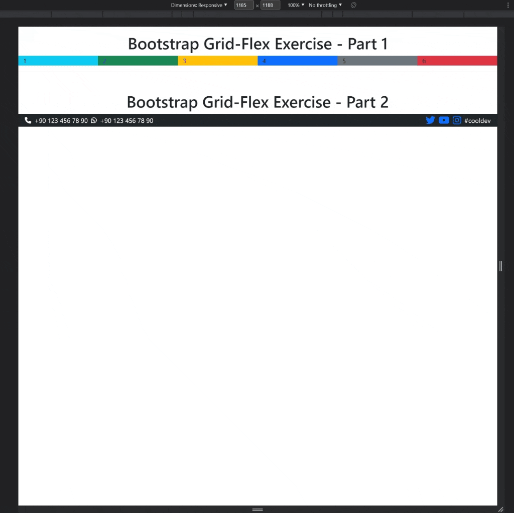

<div align=center>
	<h1>Bootstrap Flex Grid Exercise</h1>
</div>

<div align="center">
	<a href="https://ehkarabas.github.io/html-css-exercises/bootstrap-flex-grid/">
		
	</a>
	<br>
	
</div>

## Description

Simple 2 responsive rows with bootstrap flex & grid

## Goals

Practicing on bootstrap

## Resource Structure 

```
bootstrap-flex-grid(folder)
|
|-- README.md
|-- assets
|   |-- libs
|       |-- bootstrap-5.3.0-alpha1-dist
|           |-- css
|           |   |-- ...
|		|
|           |-- js
|               |-- ...
|-- images
|   |-- bootstrap-flex-grid-presentation.gif
|-- index.html
```


## Methodology

* Used

	* HTML elements
	* Bootstrap via local library

* Not used

	* Float, grid, flex layouts
	* CSS selectors
	* CSS style attributes
	* Box model
	* External CSS files
	* Position properties
	* SASS
	* CSS Media Queries
	* Display properties
	* JavaScript
		* and so on...


