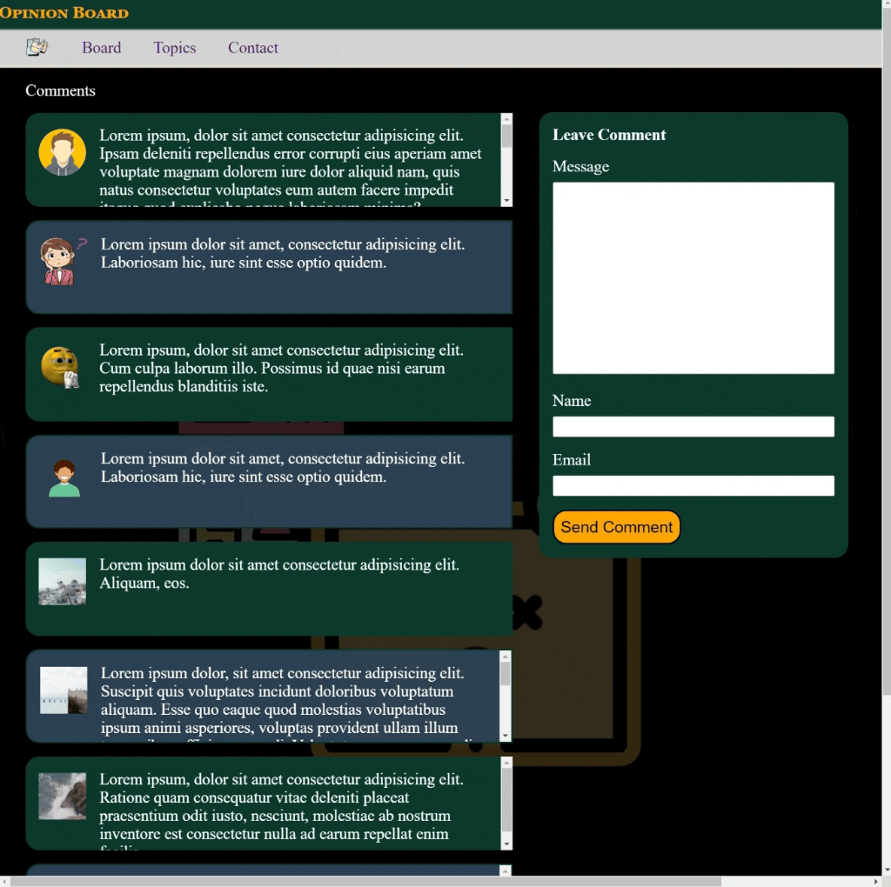

<div align=center>
	<h1>Comments Board</h1>
</div>

<div align="center">
	<a href="https://ehkarabas.github.io/html-css-exercises/comments-board/">
		
	</a>
	<br>
	
</div>

## Description

Basic responsive comments page design via common stylized comment containers. 

## Goals

Practicing on; 

* Pseudo classes
* Position properties
 

## Resource Structure 

```
comments-board(folder)
|
|-- README.md
|-- images
|   |-- avatar1.png
|   |-- avatar2.png
|   |-- avatar3.png
|   |-- avatar4.png
|   |-- brand.png
|   |-- comment.png
|   |-- comments-board-presentation.gif
|   |-- no-comment.png
|-- index.html
|-- style
    |-- style.css
```


## Methodology

* Used

	* HTML elements
	* CSS selectors
	* CSS style attributes
	* Box model
	* Position properties
	* Display properties
	* External CSS files
	* CSS Media Queries


* Not used

	* Float, grid, flex layouts
	* Bootstrap
	* JavaScript
		* and so on...


