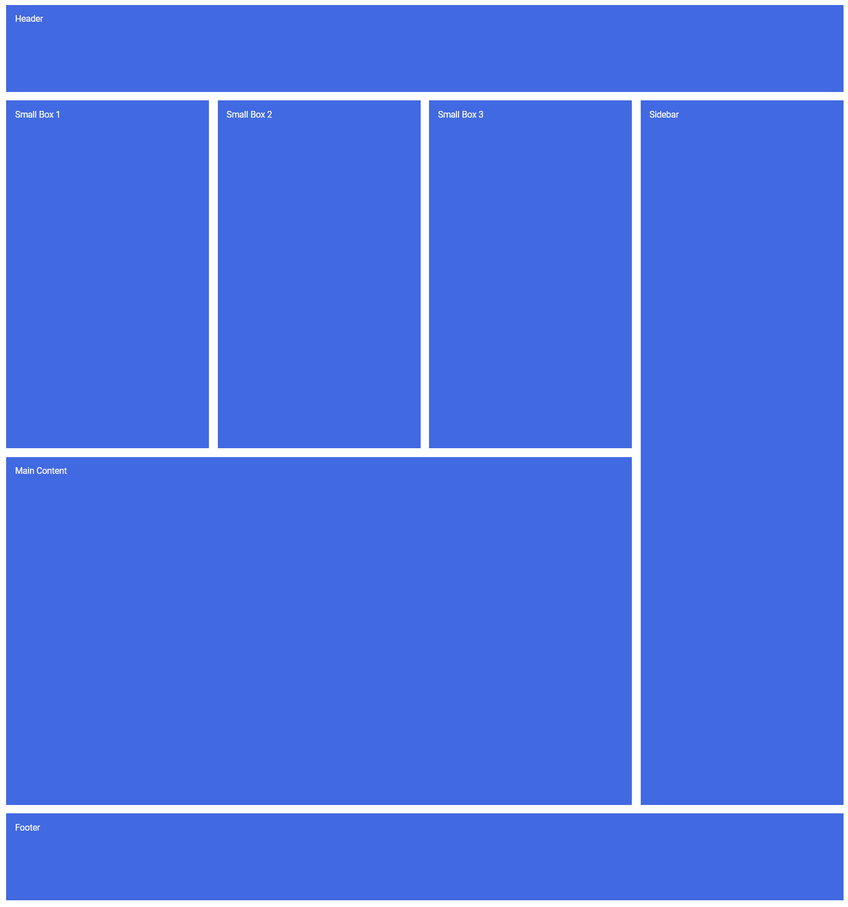

<div align=center>
	<h1>Semantic Containers With Grid</h1>
</div>

<div align="center">
	<a href="https://ehkarabas.github.io/html-css-exercises/containers-with-grid/">
		
	</a>
	<br>
	
</div>

## Description

A layout built with Grid for CSS semantic containers

## Goals

Practicing on grid

## Resource Structure 

```
containers-with-grid(folder)
|
|-- README.md
|-- images
|   |-- grid-semantic-conatiners-presentation.png
|   |-- ref-css-grid.png
|-- index.html
|-- style
    |-- style.css
```


## Methodology

* Used

	* HTML elements
	* CSS selectors
	* CSS style attributes
	* Box model
	* Grid
	* CSS Variables
	* External CSS files


* Not used

	* Float, flex layouts
	* Position properties
	* Display properties(grid excl.)
	* CSS Media Queries
	* Bootstrap
	* JavaScript
		* and so on...


