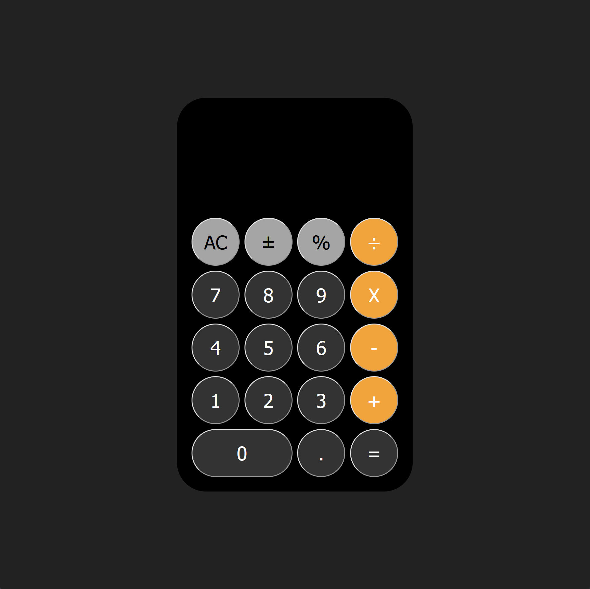

<div align=center>
	<h1>Grid Calculator</h1>
</div>

<div align="center">
	<a href="https://ehkarabas.github.io/html-css-exercises/grid-calculator/">
		
	</a>
	<br>
	
</div>

## Description

A layout built with Grid for a basic calculator

## Goals

Practicing on grid

## Resource Structure 

```
grid-calculator(folder)
|
|-- README.md
|-- images
|   |-- grid-calculator-presentation.png
|   |-- ref-css-grid-ios.png
|-- index.html
|-- style
    |-- style.css
```


## Methodology

* Used

	* HTML elements
	* CSS selectors
	* CSS style attributes
	* Box model
	* Grid
	* Flex
	* CSS Variables
	* External CSS files


* Not used

	* Float
	* Position properties
	* Display properties(grid, flex excl.)
	* CSS Media Queries
	* Bootstrap
	* JavaScript
		* and so on...


