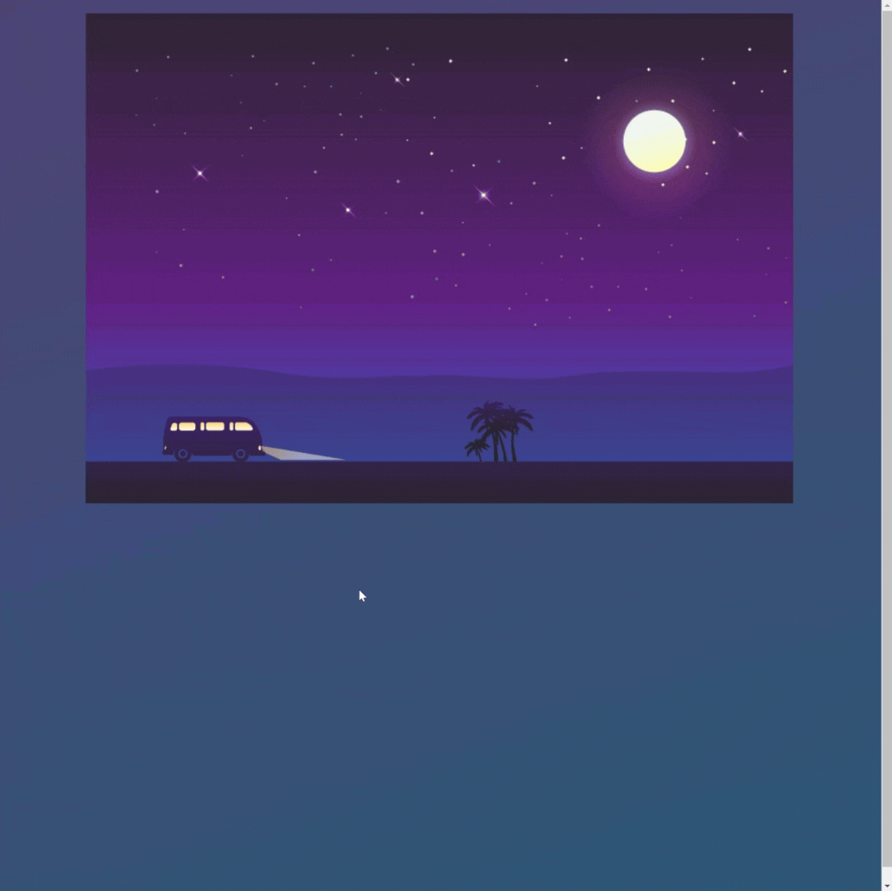

<div align=center>
	<h1>Hopping Car Animation</h1>
</div>

<div align="center">
	<a href="https://ehkarabas.github.io/html-css-exercises/hopping-car/">
		
	</a>
	<br>
	
</div>

## Description

Basic CSS Animation.

## Goals

Practicing on animation and transform properties.


## Resource Structure 

```
demo-site(folder)
|
|-- README.md
|-- hoppingCar.html
|-- images
|   |-- Img_02.png
|   |-- Img_05.png
|   |-- Img_06.png
|   |-- Img_1.png
|   |-- hopping-car-presentation.gif
|-- style
    |-- hoppingCar.css
```


## Methodology

* Used

	* HTML elements
	* CSS selectors
	* CSS style attributes
	* Box model
	* Animation & Transform
	* Position properties
	* External CSS files


* Not used

	* Float, Grid, flex layouts
	* CSS Media Queries
	* Display properties
	* Bootstrap
	* JavaScript
		* and so on...


