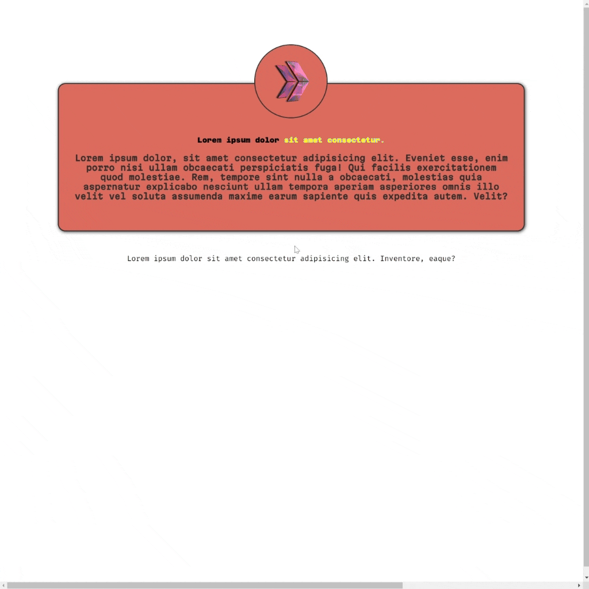

<div align=center>
	<h1>Margins</h1>
</div>

<div align="center">
	<a href="https://ehkarabas.github.io/html-css-exercises/margins/">
		
	</a>
	<br>
	
</div>

## Description

Centering a simple layout via position properties. 

## Goals

Practicing on position properties.
 

## Resource Structure 

```
margins(folder)
|
|-- README.md
|-- images
|   |-- cw.jpg
|   |-- margins-presentation.gif
|   |-- reference.png
|-- index.html
|-- style
    |-- style.css
```


## Methodology

* Used

	* HTML elements
	* CSS selectors
	* CSS style attributes
	* Box model
	* Position properties
	* External CSS files


* Not used

	* Float, grid, flex layouts
	* Display properties
	* CSS Media Queries
	* Bootstrap
	* JavaScript
		* and so on...


