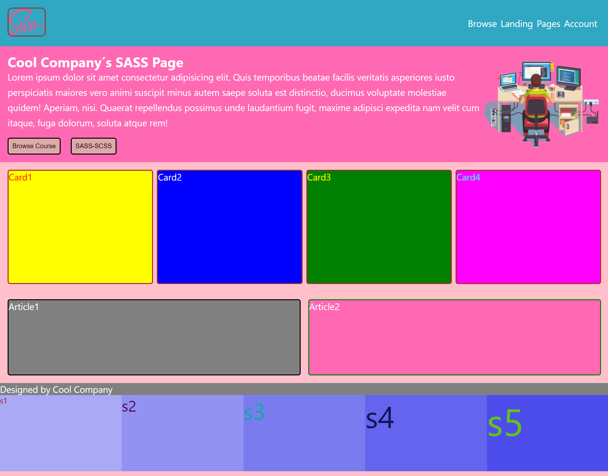

<div align=center>
	<h1>Landing With SASS</h1>
</div>

<div align="center">
	<a href="https://ehkarabas.github.io/html-css-exercises/sass-landing-exercise/">
		
	</a>
	<br>
	
</div>

## Description

A simple landing page design with SASS

## Goals

Practicing on SASS

## Resource Structure 

```
sass-landing-exercise(folder)
|
|-- README.md
|-- images
|   |-- banner-img.png
|   |-- sass-landing-exercise-presentation.png
|   |-- sass.png
|-- index.html
|-- main.css
|-- main.css.map
|-- main.scss
```


## Methodology

* Used

	* HTML elements
	* CSS selectors
	* CSS style attributes
	* Box model
	* Flex
	* External CSS files
	* SASS


* Not used

	* Float, grid layouts
	* Position properties
	* Display properties(flex excl.)
	* CSS Media Queries
	* Bootstrap
	* JavaScript
		* and so on...


